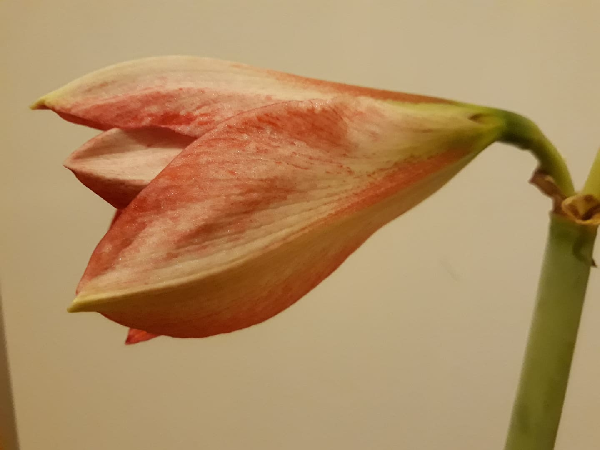
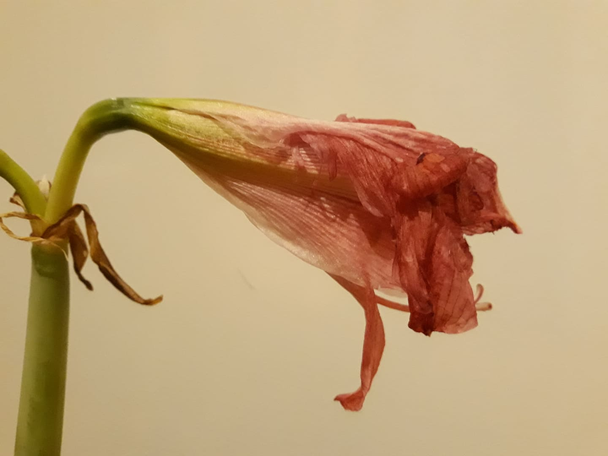
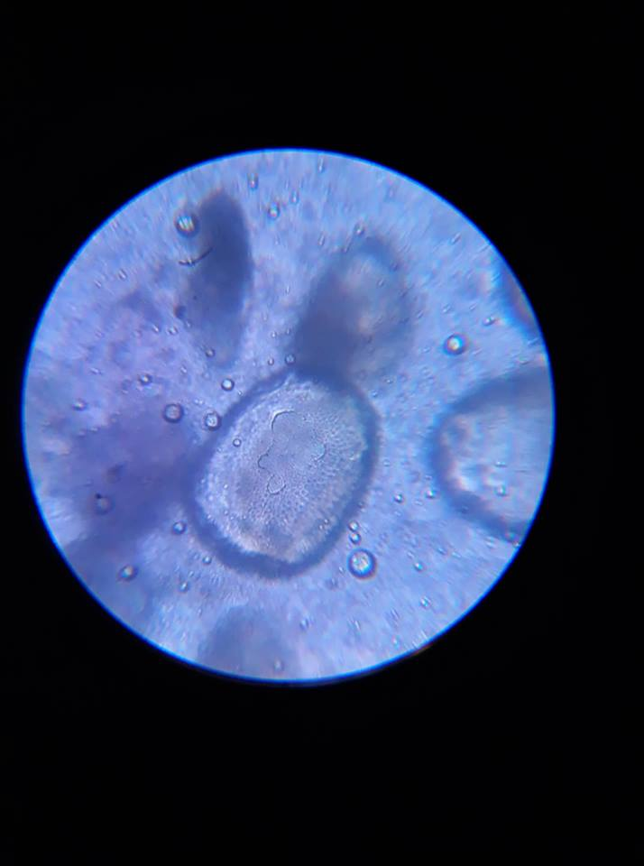
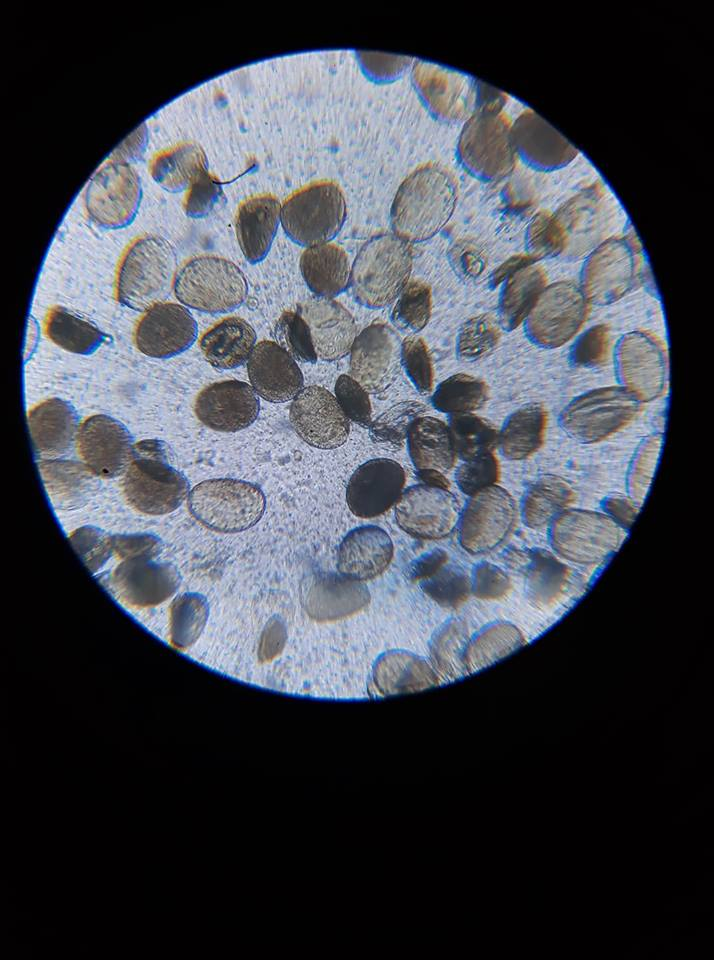

# setting
 
```{r}
SciViews::R
```

# data
```{r}
stalk_evo <- read("../data/stalk_evo.rds")
flower_evo <- read("../data/flower_evo.rds")
flower_day <- read("../data/flower_day.rds")

flower_evo <- unite(flower_evo , col = "stalk_flower" , stalk , flower , sep = "_")
```


# Results


## Stalk evolution


```{r}
chart(stalk_evo, height ~ day %col=% stalk ) + 
  geom_point()


```

## flower calendar


### Metadata information


Here is a table including the flower evolution in the time, like a type of flower calendar.

The first column is named stalk_number, the first number is the stalk id and the second one corresponds to the flower id (separed by corresponding stalk). The combination resulting is the global flower id.

The day_birth means the day when the floral envelope opens. I have considered the birth day as the day when a petal take off of the others.

The day_death means the day when the floral envelope closes. I have considered the death day as the day when a folded petal cut the central axis of symmetry.





### Table
```{r}
knitr::kable(flower_day,
               caption = "day of the flower birth")
```


### Charts 


### Analysis


## flower evolution

I have taken measurements during the flower "life time". That means from the birth day to the death day (see flower calendar for more explanations)

```{r}
a <- chart(flower_evo, petal_lg ~ age_day %col=% flower) + geom_point()

b <- chart(flower_evo, male_lg ~ age_day %col=% flower) + geom_point()

c <- chart(flower_evo, fml_lg ~ age_day %col=% flower) + geom_point()

combine_charts(list(a,b,c))
```


# Pollen







