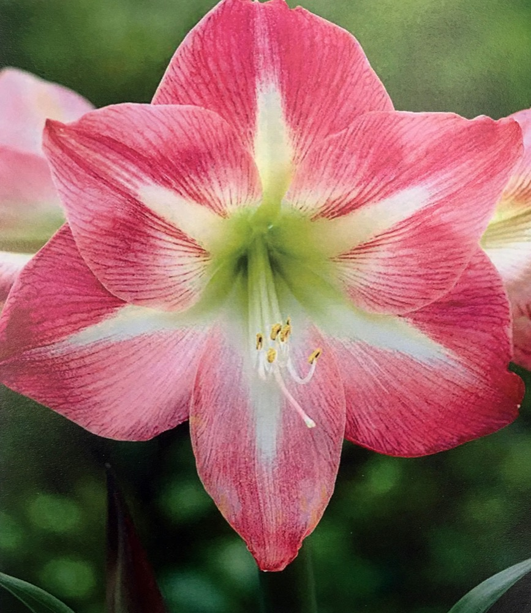

# setting
 
```{r}
SciViews::R
```

# data
```{r}

```




# Stalk evolution


```{r}
chart(stalk_evo, height ~ day %col=% stalk ) + 
  geom_point() 


```

# flower birth day


```{r}
pander::pander(flow,
               caption = "day of the flower birth")
```


# flower evolution


```{r}
chart(flower_evo, petal_lg ~ age_day ) + geom_point()
```


